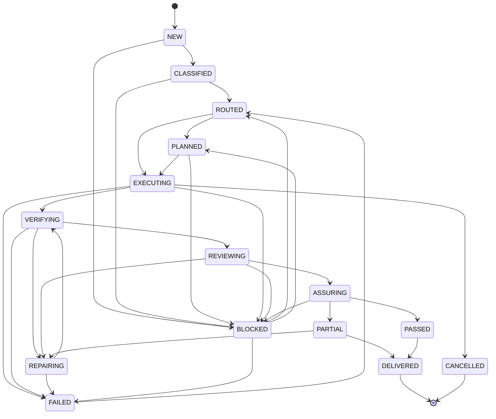

# 27 — State Model

## Estados de execução

O texto-base sugere `NEW`, `CLASSIFIED`, `ROUTED`, `PLANNED`, `EXECUTING`, `VERIFYING`, `REVIEWING`, `REPAIRING`, `BLOCKED`, `FAILED`, `PASSED`, `DELIVERED`. O Harness acrescenta `ASSURING`, `PARTIAL` e `CANCELLED` para representar assurance, degradação e encerramento; todos são estados de lifecycle propostos. Task, gate, verification e evidence continuam separados para não colapsar semânticas.

| Estado proposto | Significado | Evidência de entrada | Saídas típicas |
| --- | --- | --- | --- |
| `NEW` | goal recebido, ainda não classificado | TASK_RECEIVED | CLASSIFIED/BLOCKED |
| `CLASSIFIED` | profile com confidence/unknowns | profile record | ROUTED/BLOCKED |
| `ROUTED` | RouteDecision emitida | route artifact | PLANNED/EXECUTING |
| `PLANNED` | acceptance/graph/owners definidos | plan/graph | EXECUTING/BLOCKED |
| `EXECUTING` | specialists/tools em execução | task RUNNING | VERIFYING/BLOCKED/FAILED |
| `VERIFYING` | procedures/evidence atuais em coleta | verification started | REVIEWING/REPAIRING/FAILED |
| `REVIEWING` | critic/domain/integration review | report + bar | REPAIRING/PASSED/BLOCKED |
| `REPAIRING` | change bounded após gap | finding/root-cause hypothesis | VERIFYING/BLOCKED/FAILED |
| `ASSURING` | required gates, residual risk e stop decision | verification + critique | PASSED/PARTIAL/BLOCKED |
| `BLOCKED` | dependency/authority/evidence impede avanço | blocker record | ROUTED/PLANNED/FAILED/PARTIAL |
| `FAILED` | bounded attempt inválida | failure record | ROUTED (novo run) |
| `PASSED` | required criteria pass no scope observado | gate + current evidence | DELIVERED |
| `PARTIAL` | parte do goal entregue com limitation explícita | partial artifact + report | REPAIRING/DELIVERED |
| `DELIVERED` | artifact entregue dentro de authority | delivery record | EVOLUTION |
| `CANCELLED` | execução encerrada por autoridade, user ou stop | cancellation record | terminal |

## Status semânticos separados

- **Task status:** `PENDING`, `READY`, `RUNNING`, `IMPLEMENTED`, `REVIEW`, `REWORK`, `VERIFIED`, `DONE`, `BLOCKED`, `FAILED`.
- **Gate status:** `PENDING`, `PASS`, `PASS_WITH_CONDITIONS`, `FAIL`, `BLOCKED`, `NOT_APPLICABLE`.
- **Verification status:** `PASS`, `PARTIAL`, `FAIL`, `BLOCKED`, `NOT_RUN`.
- **Evidence status:** `CONFIRMED`, `INFERRED`, `PROPOSED`, `UNKNOWN`; freshness `CURRENT`, `STALE`, `UNKNOWN`.

`PASSED` no diagrama não substitui esses campos. O state record deve apontar gate/verification records exatos.

## Transições permitidas

Esta lista de edges é a fonte canônica do lifecycle documental. O arquivo [`diagrams/state-machine.mmd`](./diagrams/state-machine.mmd) deve permanecer semanticamente idêntico; labels podem apenas explicar a transição, não criar uma nova.

## Recovery

Após interrupção, ler state pointer, plan/task, backlog, execution/verification ledgers, artifacts e filesystem/runtime. Se artifact mudou mas evidence não foi registrada, voltar a `VERIFYING`. Não inventar histórico.

## State invariants

- state aponta uma única next action executável;
- task/status e state não divergem;
- `DONE` exige current verification PASS e nenhum blocker;
- `PASSED` exige gate/evidence bound;
- later failure/reopen invalida PASS anterior;
- `BLOCKED` registra causa, owner, dependency e revalidation trigger;
- `DELIVERED` não implica release/production authority.
